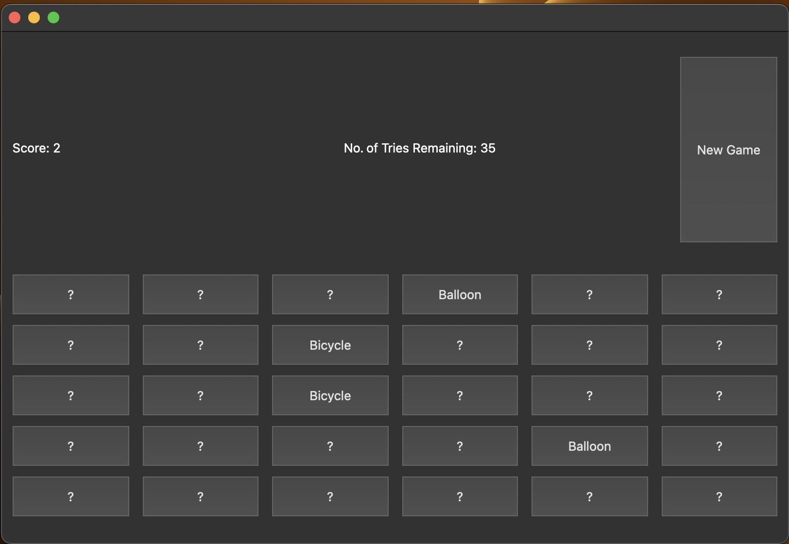

# Card Matching Game
This is a simple card matching game. The game is built QT and C++ by [Soner Kuyar](www.github.com/sonerkuyar) and [Sezer Çot](www.github.com/sezercot).
Game is designed for 2 players. Players take turns to open 2 cards. If the cards are matched, the player gets 1 point. If not, the cards are closed and the turn is passed to the other player. The game continues until all the cards are matched. The player with the most points wins the game.
This is the Screen of the game:

## Requirements
- QT 6.5.0
- C++ 17

## Installation
- Clone the repository
- Open the project with QT Creator
- Run the project

Alternatively, you can run the executable on machine Mac OS high sierra or later (ARM64 architecture).

